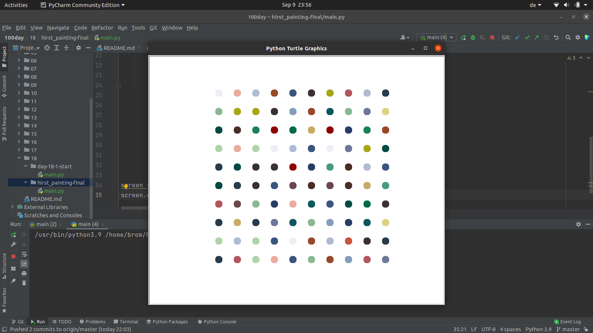

<h1 align="center"> 
100 Days of Python
</h1>
<h5 align="center">
Starting from : August 22, 2021
</h5>

[Day 1 - Beginner - Working with Variables in Python to Manage Data](https://github.com/neubrom/100day/tree/master/01)

[Day 2 - Beginner - Understanding Data Types and How to Manipulate Strings](https://github.com/neubrom/100day/tree/master/02)

[Day 3 - Beginner - Control Flow and Logical Operators](https://github.com/neubrom/100day/tree/master/03)

[Day 4 - Beginner - Randomisation and Python Lists](https://github.com/neubrom/100day/tree/master/04)

[Day 5 - Beginner - Python Loops](https://github.com/neubrom/100day/tree/master/05)

[Day 6 - Beginner - Python Functions & Karel](https://github.com/neubrom/100day/tree/master/06)

[Day 7 - Beginner - Hangman](https://github.com/neubrom/100day/tree/master/07)

[Day 8 - Beginner - Function Parameters & Caesar Cipher](https://github.com/neubrom/100day/tree/master/08)

[Day 9 - Beginner - Dictionaries, Nesting and the Secret Auction](https://github.com/neubrom/100day/tree/master/09)

[Day 10 - Beginner - Functions with Outputs](https://github.com/neubrom/100day/tree/master/10)

[Day 11 - Beginner - The Blackjack Capstone Project](https://github.com/neubrom/100day/tree/master/11)

[Day 12 - Beginner - Scope & Number Guessing Game](https://github.com/neubrom/100day/tree/master/12)

[Day 13 - Beginner - Debugging: How to Find and Fix Errors in your Code](https://github.com/neubrom/100day/tree/master/13)

[Day 14 - Beginner - Higher Lower Game Project](https://github.com/neubrom/100day/tree/master/14)

[Day 15 - Intermediate - Local Development Environment Setup & the Coffee Machine](https://github.com/neubrom/100day/tree/master/15)

[Day 16 - Intermediate - Object Oriented Programming (OOP)](https://github.com/neubrom/100day/tree/master/16)

[Day 17 - Intermediate - The Quiz Project & the Benefits of OOP](https://github.com/neubrom/100day/tree/master/17)

[Day 18 - Intermediate - Turtle & the Graphical User Interface (GUI)](https://github.com/neubrom/100day/tree/master/18)

[Day 19 - Intermediate - Instances, State and Higher Order Functions](https://github.com/neubrom/100day/tree/master/19)

[Day 20 - Intermediate - Build the Snake Game Part 1: Animation & Coordinates](https://github.com/neubrom/100day/tree/master/20)

[Day 21 - Intermediate - Build the Snake Game Part 2: Inheritance & List Slicing](https://github.com/neubrom/100day/tree/master/21))

[Day 22 - Intermediate - Build Pong: The Famous Arcade Game](https://github.com/neubrom/100day/tree/master/22)

[Day 23 - Intermediate - The Turtle Crossing Capstone Project](https://github.com/neubrom/100day/tree/master/23)

[Day 24 - Intermediate - Files, Directories and Paths](https://github.com/neubrom/100day/tree/master/24)

[Day 25 - Intermediate - Working with CSV Data and the Pandas Library](https://github.com/neubrom/100day/tree/master/25)

[Day 26 - Intermediate - List Comprehension and the NATO Alphabet](https://github.com/neubrom/100day/tree/master/26)

[Day 27 - Intermediate - Tkinter, *args, **kwargs and Creating GUI Programs](https://github.com/neubrom/100day/tree/master/27)

[Day 28 - Intermediate - Tkinter, Dynamic Typing and the Pomodoro GUI Application](https://github.com/neubrom/100day/tree/master/28)

[Day 29 - Intermediate - Building a Password Manager GUI App with Tkinter](https://github.com/neubrom/100day/tree/master/29)

[Day 30 - Intermediate - Errors, Exceptions and JSON Data: Improving the Password](https://github.com/neubrom/100day/tree/master/30)

[Day 31 - Intermediate - Flash Card App Capstone Project](https://github.com/neubrom/100day/tree/master/31)

